# Conceptos de curso intermedio de espada larga Italiana 1, año 2023.

### Indice
I - [Sobre el seño y virtudes](#i-sobre-el-ceño-y-las-virtudes)

II - [Cortes](#ii-cortes)

III - [Mesura](#iii-mesura)

IV - [Tempos](#iv-tempos)

V - [Rotare](#v-rotare)

VI - [Guardias o postas](#vi--guardias-o-postas)

VII - [Defensas o coberturas](#vii--defensas-o-coberturas)

VIII - [Juegos largos](#viii-juegos-largos)

## I-Sobre el ceño y las virtudes:

En la metodología pedagógica de Fiore de Liberi , se utilizan los conceptos de virtudes fundamentales del guerrero, los cuales se encarnan en animales (o perritos que quieren ser otros animales).

Esto se analiza en una representación gráfica de Fiore, conocida como su ceño. En él, expresa con la representación de un hombre al frente, acompañado de estas expresiones animalescas de las virtudes que debe tener un esgrimista:

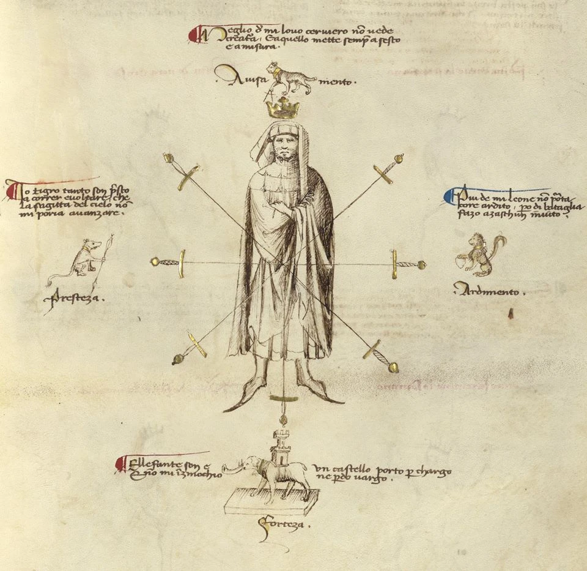

Estos valores son los siguientes:

**a-Celeritas o velocidad**, representada por el tigre, quien se impone ante sus rivales con su reacción rápida, siempre atacando primero. Tiene como principal instrumento, la flecha.

Dicho ítem refleja la celeridad de cada esgrimista hacia su rival, como si este último fuese una diana a la cual apuntar. Está en el lado derecho del esgrimista.

**b-Audatia o audacia** (o coraje), encarnado por el león, quien siendo el rey de la selva, se impone con su tenacidad y valentía frente a sus adversarios.

Tiene como objeto característico el corazón, ya que la valentía es un fuego que insufla el órgano cardiaco de cada esgrimista, como fuente inagotable de voluntad que lo motiva a superar los obstáculos que enfrenta. Está en el lado izquierdo del esgrimista.

**c-Prudentia o prudencia**, ejemplificado por el lince, el cual es la criatura que siempre sabe reaccionar bien ante cualquier situación en los combates, dando el fundamento lógico racional a las acciones que el esgrimista debe ejercer para imponerse sobre su adversario. Tiene como su instrumento el compás, objeto que ayuda a medir y calcular sus acciones. Está sobre la cabeza del esgrimista.

**d- Fortitudo o fuerza**, personificado por el elefante, la bestia terrestre más imponente de todas, quien jamás se somete ante el enemigo a pesar de los embates que sufre. Su objeto característico es la torre, ítem que refleja la contundencia y resistencia que debe tener el esgrimista de sus piernas y tronco inferior de su cuerpo, como base sólida de sus movimientos. Está bajo las piernas del esgrimista.

## II-Cortes.

Dentro del ceño de Fiore, se muestran 7 cortes a los cuales el esgrimista se ve expuesto, los cuales son 4 diagonales (dos ascendentes y otros dos descendentes), dos golpes laterales y uno corte vertical ascendente.

Estos tipos de cortes, los conocemos de la siguiente manera:

**a-Fendente:** Es un corte que se ejecuta desde arriba hacia abajo. Ósea, es descendente. Se realiza con filo verdadero.

**b-Messani:** Es un corte horizontal ya sea de derecha a izquierda o viceversa. Se realiza con filo verdadero.

**c-Sottani:** Es un corte ascendente, o en otras palabras, se proyecta desde abajo hacia arriba. Se realiza preferentemente con filo falso, pero se puede también con verdadero.

## III-Mesura:

Como ya se ha visto en clase, la distancia es el espacio o intervalo de lugar que media entre dos cosas o sucesos, En este curso, la distancia se conoce como “mesura”.

La respecto, se conocen estas mesuras:

**a-Messura Longa (distancia larga):** Las espadas chocan por el débil de la hoja. Se puede alcanzar al oponente con un golpe a pesar de estar lejos de él, dando un paso. Esta distancia también se puede medir con tres pasares entre mi persona y el rival.

**b- Media Messura (distancia media):** Las espadas pueden cruzarse a la mitad de la hoja. Se puede tocar al rival en su zona de tronco y brazos, después de dar el paso. Esta mesura si bien es cierto no es canónica según la tradición de Fiore, para efectos de este curso será oficial (Porque Shinji así lo quiere). (Para mayor información sobre la teoría shinjista de la distancia media, se les sugiere hablar con dicho semi-elfo).

**c-Messura breve (distancia corta):** Estoy muy cerca y puedo tocar a mi oponente sin necesidad de dar un paso, ya que estoy en una distancia íntima con éste. Esta distancia también se puede medir con un pasar entre mi persona y el rival.

**d-Messura Rota:** Esta distancia como bien dice su nombre, está rota. No sirve para atacar al contrario, aún dando tanto él como yo un paso- Esto se debe a que nadie puede tocar ni chocar sus espadas. La única utilidad práctica que tiene esta messura radica en evitar la ofensiva del rival, alejándose mucho de su embate. Eso sí, con la desventaja de no poder atacarle de inmediato, por la lejanía que supone esto.

## IV-Tempos:

Como ya se ha dicho, el concepto de tiempo se entiende como *“el periodo medible entre dos eventos, más concretamente entre causas y efecto”*. Estos son los tipos de tempos que veremos en este año:

**a-Stesso-Tempo:** Consiste en realizar una acción en calidad de combatiente en contra de la reacción del contrincante al mismo tiempo (por ejemplo, ambos contrincantes ((el rival y yo)) luchamos en tiempos medibles en la nota musical “negrita” y por eso, nos cortamos al mismo tiempo en algún momento). Técnicamente, los “dobles” que vemos cotidianamente en nuestras prácticas pasan porque los rivales se atacan en este tiempo.

**b-El Mezzo-Tempo:** Corresponde a la realización de una acción que toma un medio tiempo de lo que en general alguien demora por golpe. En otras palabras, es una reacción generada en la mitad del tiempo que un acometimiento normal. (En el ejemplo anterior, uno de los contrincantes que ataca siempre en notas musicales “negritas”, realiza ahora un ataque bajo la nota musical “semi-corchea”)

**c-El Dui-Tempo:** Se trata en definitiva de una réplica a un ataque. Se refiere a un golpe, desde el cual inmediatamente se ejecuta otro golpe aún más veloz. Por eso en esencia, son dos golpes o tiempos. (En el ejemplo anterior, uno de los contrincantes hace su primer golpe bajo la nota musical “negrita”, para inmediatamente realizar un segundo golpe bajo la nota musical “semi-corchea”)

## V-Rotare:

El “Rotaggiare”, “Rota” o “Rotare” (como lo conocemos en clase), significa “girar” y es mencionado por Filippo Vadi, utilizando golpes y guardias enseñados por Fiore dei Liberi.
Se trata de la sucesión de golpes frontales ininterrumpidos y constantes en contra del rival, de mínimo 3 golpe.Teóricamente, los golpes dentro del rotare pueden comenzar desde las guardias pulsativas (aunque es más habitual que una guardia pulsativa termine el rotare con su golpe fulminante) y se mantienen con guardias inestables.

Las guardias estables no sirven para el rotare, porque siempre lo rompen.

El objetivo de esto es generar aperturas con ataques concatenados y consecutivos y así poder acceder a la cabeza del oponente.

Debe tomarse en cuenta que el rotare es como una cadena. Cada eslabón conocido como “rota”, equivale a un golpe que se va concatenando con otro de forma sucesiva. Por ello, lacadena será más larga a medida que tenga más eslabones (rotas o golpes).

Cada rota equivale a un corte (fendente, mezzanine y sotani). Las estocadas o “puntas” no sirven como rotare, debido a que no son fáciles de concatenar al instante con otros acometimientos. Por ello, una punta rompe el rotare.

## VI- Guardias o postas:

Se conocen por medio de Fiore,tres categorías de guardias en donde cada una de éstas se acomoda mejor a distintas situaciones, ya sea para defender o atacar desde distintos puntos. Estas son:

**a-Guardias inestables:**

Se caracterizan por ser guardias que van transicionando entre unas y otras. Por ello, están pensadas para variar en distintas defensas y ataques de forma contínua, debido a que no están ideadas para mantenerse estáticamente (a diferencia de las guardias estables).

A su vez, no necesitan cambiar los pies para preparar sus golpes los ataques, como tampoco dependen de la lateralidad de su postura (salvo en Posta Di Fenestra. Esto último se indicará en su apartado).

**b-Guardias estables:**

Se caracterizan por ser guardias mega hiper estáticas y fuertes. Son en si, la encarnación táctica de la virtud de la fortaleza para el combatiente italiano.

Por ello, no están pensadas para variar en distintas defensas y ataques de forma contínua, ya que su razón de ser y eficacia consisten en mantenerse estáticamente.Por lo tanto, rompen el rotare en vez de mantenerlo.

Se distinguen por no necesitar de un paso de preparación para realizar el golpe deseado y depender mucho de la lateralidad de su guardia para su total eficacia.

**c-Guardias pulsativas:**

Son las que tienen como primordial función, la realización de grandes golpes fulminantes, los cuales se deben previamente preparar tanto con un cambio de pies como con un movimiento corporal explosivo. No dependen de la lateralidad de su guardia para su efectividad.

Como ya se explicó previamente, estas guardias acaban un rotare, debido a que su golpe fulminante tiende a ser el último de dicha cadena de golpes. Puede también empezar uno como rota, pero no se suele ver mucho eso en la práctica.

### VI-a: Todas las guardias inestables:

**i-Posta Breve:** Esta guardia se distingue por colocar la espada al frente, direccionada diagonalmente hacia arriba , mientras su pomo apunta cercanamente a nuestro tronco. Esta es la guardia más básica y clave de todas las inestables, ya que ésta permite transicionar de manera natural y efectiva a otras guardias inestables. Es sí, la base de todas éstas, por lo que dominarla permite la libre y natural ejecución de las otras en el instante mismo para mantenerse activo en el combate.

A su vez, su sencillez permite cómodamente a su usuario, estocar y cortar rápidamente. A su vez es relajada y fácil de mantener para recuperarse de la fatiga durante el duelo.

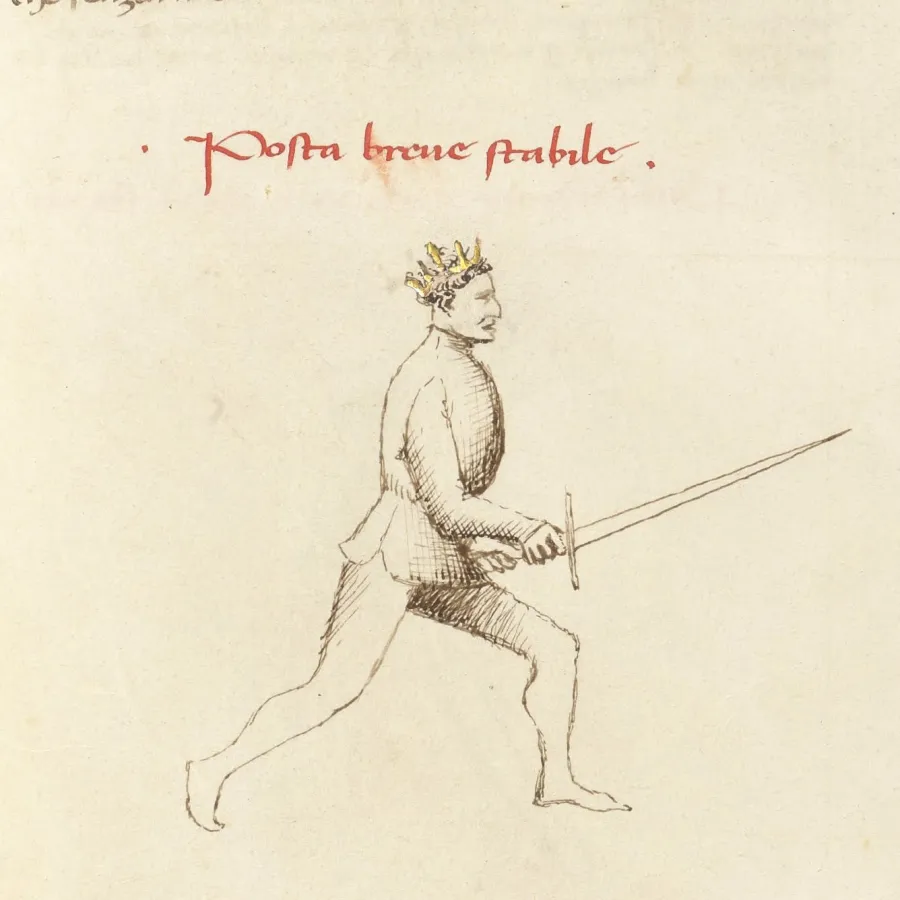

**ii-Posta Longa:** Esta posición mantiene la espada extendida hacia adelante, con la punta de nuestra espada fija en contra del oponente. Con ella, se pueden realizar cortes muy cómodamente y estocadas muy eficaces. También es muy útil para mantener la misura longa con el rival y por ello, medir la distancia que se tiene contra éste.

Adicionalmente, cabe destacar que esta guardia permite la realización efectiva de todos los juegos largos. Por ello, dominarla implica la naturalidad de emplear estos movimientos estratégicos en misura longa, siempre con suma eficacia.

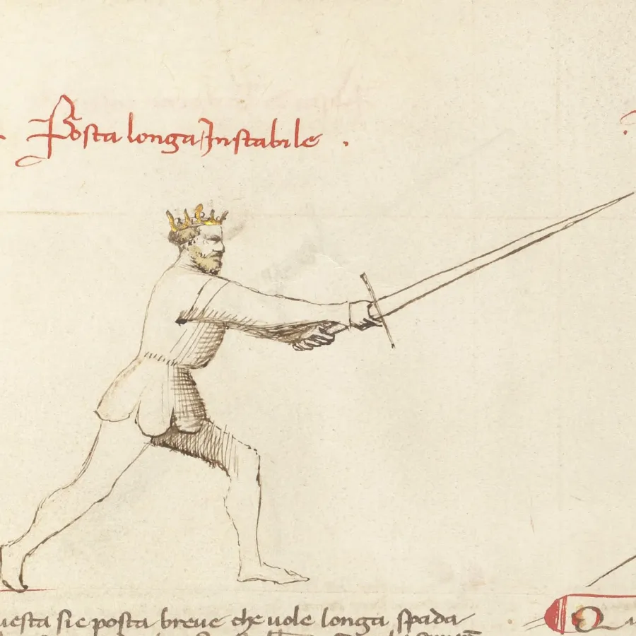

**iii-Posta di Fenestra:** Esta postura se distingue por tener la espada en casi en horizontal (en realidad, diagonalmente, lo que se conoce como “colgante") sobre la cabeza o al nivel de la oreja o frente. Nuestra hoja siempre estará con su filo y contrafilo mirando respectivamente el cielo y el suelo (ósea, en vertical).Nunca en horizontal (ya que eso es la Ox alemana y este no es un curso de espada larga alemana.No se come chucrut acá).

Es muy útil para reflectar la espada del oponente en un ataque descendente. Tiene la peculiaridad de tener lateralidad a pesar de ser inestable, por lo que hay que acomodarse para defender pero es rápida para atacar.

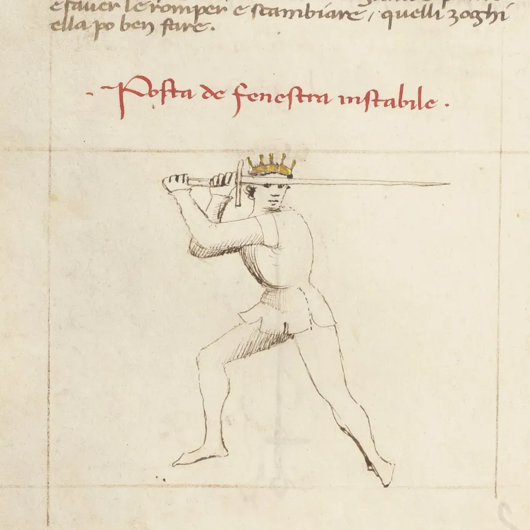

**v-Posta di Bicorno:** En esta posición, la espada se ubica horizontalmente a la altura del pecho con el pomo pegado o cercano a éste (esto varía si el practicante es hombre o mujer, por obvias razones). Ambas manos tomarán la empuñadura con las palmas mirando al cielo y con los brazos flectados bien juntos al cuerpo.

Es una guardia muy inestable, lo que permite engañar fácilmente y hacer estocadas y/o cortes rápidos e inesperados (es más natural hacer estocadas o puntas que cortes, pero se puede utilizar para hacer ambos acometimientos).

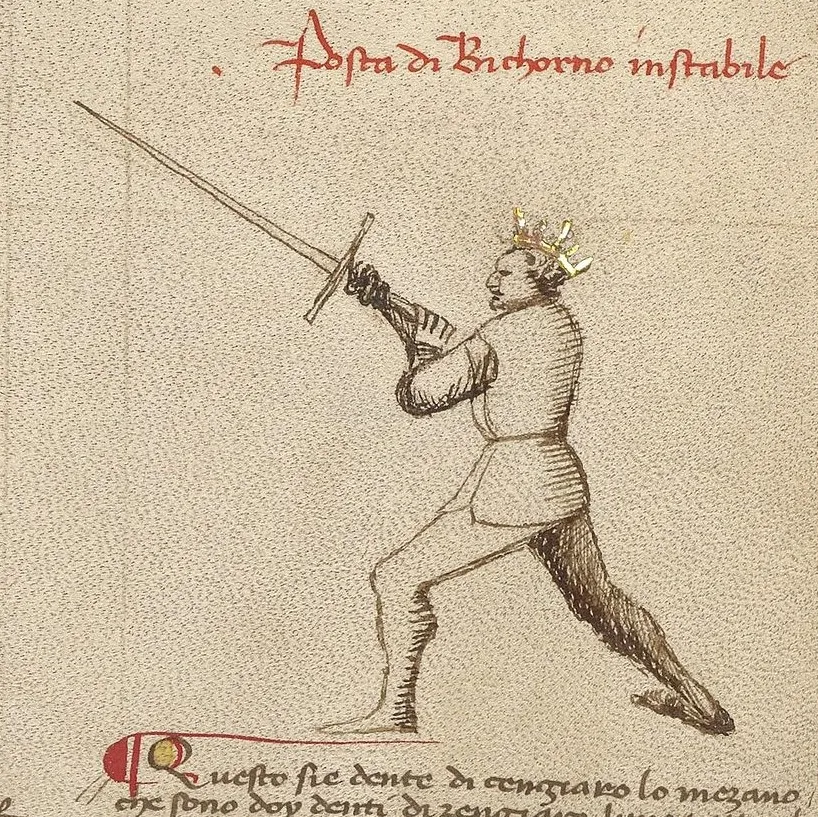

**iv-Posta di Corona:** Esta guardia se revela, teniendo una espada apuntando hacia arriba en diagonal ascendente, con su plano mirando a nuestro frente. Es muy útil para defenderse de cualquier punto con cortes laterales, sobre todo de estocadas contra la que puede hacer un contraataque rápido.

De forma anecdótica, Fiore señala en su libro “La Flor de Batalla” que estas dos últimas guardias son contrarios naturales. Ósea, Posta di Bicornio está pensada para contrarrestar a Posta di Corona y viceversa. Esto se debe a que una está pensada como la contraria de la otra y mutuamente se pueden anular como contramedida natural. A juicio de esta cátedra, eso se puede explicar a que como ambas son las postas más versátiles de todas, es muy difícil neutralizarlas y por ello, una existe para frenar a la otra en combate, como única y posible solución por parte del rival.

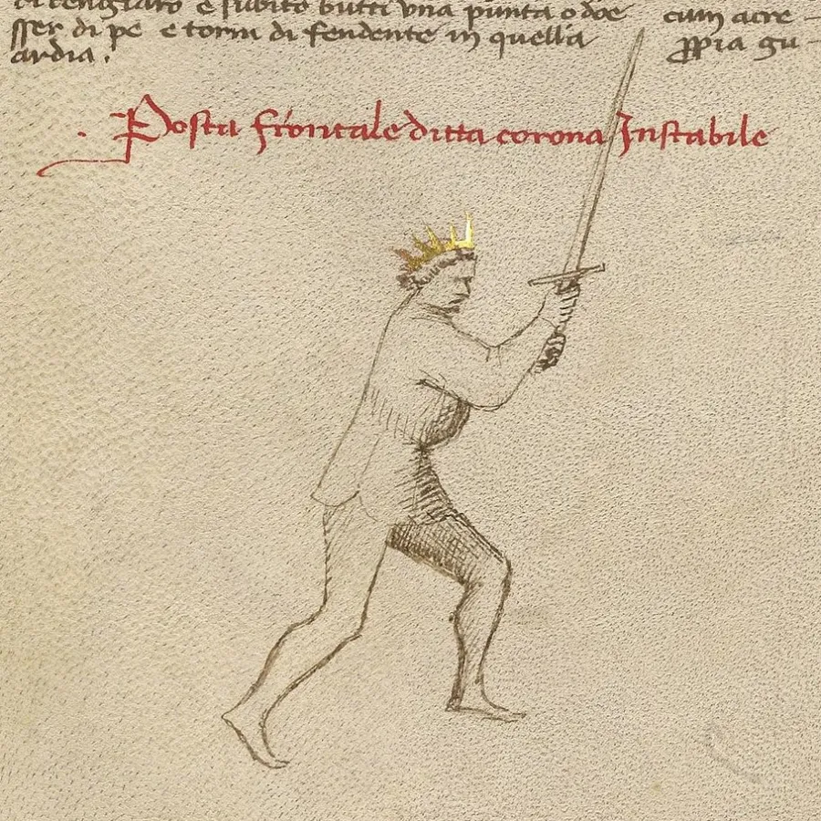

### VI-b: Todas las guardias estables:

**i-Cuda Lunga:** Se caracteriza por colocar la espada hacia atrás en diagonal hacia abajo con pomo a la altura de la cadera (cercano a ella, no necesariamente apegada). Si bien la espada apunta hacia atrás, se pueden hacer con comodidad cortes sotanni y hasta estocadas hacia el rival.

Si bien es cierto, es una guardia muy obvia en cuanto a su ejecución, si se realiza correctamente, puede ser bastante contundente para neutralizar el acometimiento del rival.

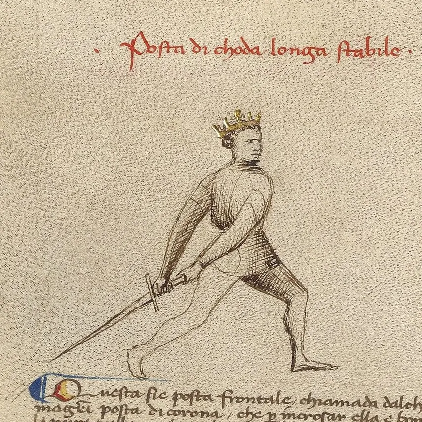

**ii-Dente di Zanghiaro:** Esta postura se caracteriza por colocar la espada, en diagonal hacia abajo y con pomo cercano o pegado a la cadera del lado idóneo a nuestra guardia (por ejemplo, si yo estoy como diestro, pondré el pomo cerca de mi cadera derecha).

Esta guardia es muy cómoda para medirse contra todas las otras,según Fiore. Esto lo señaló debido a que si bien es cierto, esta posta es estable y por ello, muy fuerte para defender, contiene un potencial ofensivo bastante vasto para acometer contra cualquier otra postura.

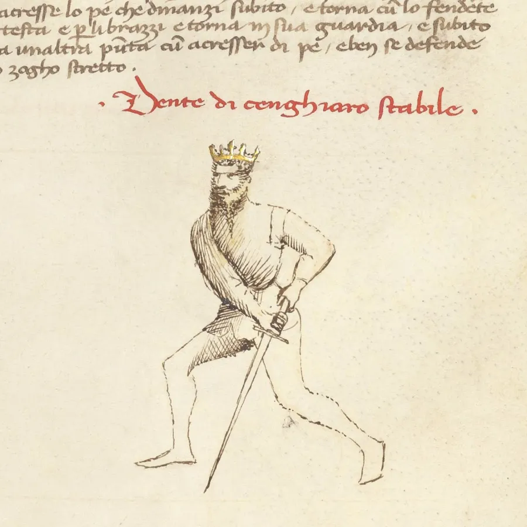

### VI-c: Todas las guardias pulsativas:

**i-Posta di Donna:** Con ella, la espada está en diagonal hacia arriba apuntando hacia atrás y pomo a la altura del pecho. Esta guardia es realmente cómoda para el descanso y mantenerse amentazante. Es versátil para atacar, ya que con ella, se pueden efectuar fendentes y messanis contundentes contra la zona superior del cuerpo del oponente e incluso, estocadas en contra del rival.

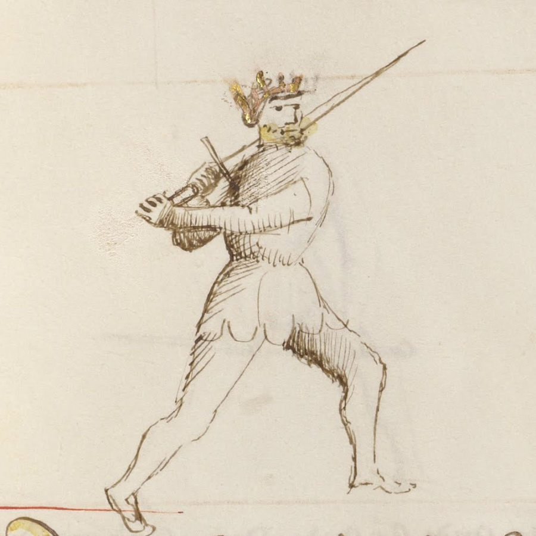

**ii-Dente di Zanghiaro messana:** Esta guardia consiste en posicionar la espada de diagonal hacia abajo, con su pomo pegado cerca de la zona de las costillas del lado hábil a la guarda. Ósea, se pone mucho más notoriamente arriba de la zona de la cadera en comparación con hermana estable (Posta di Dente di Zanghiaro).

Es muy útil para efectuar sotannis más poderosos y estocadas sorpresivas al oponente.

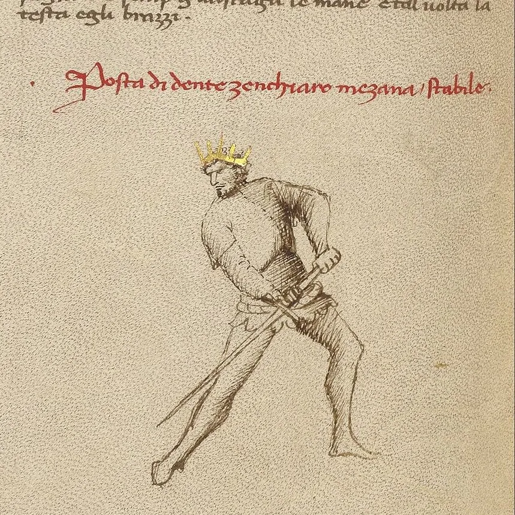

**iii-Tutta Porta di Ferro:** Con esta guardia, la espada apunta en diagonal hacia abajo, ubicándose a nuestro costado, con el pomo a la altura de la cadera y con guardia a nivel de suelo para atacar fácilmente de cortes y estocadas a las zona media de nuestro cuerpo, por medio de recios cortes sotanis y messanis. Se ubica al lado natural a la guardia, por lo que si por ejemplo estamos como diestros, se depositará a nuestro costado derecho y no al izquierdo.

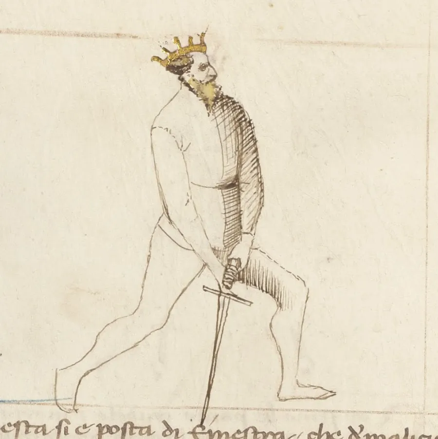

**iv-Porta di Ferro Messana:** Esta guardia se caracteriza por tener la espada siempre colocada en diagonal hacia abajo y con el pomo a nivel de cadera del lado hábil de nuestra postura ( ejemplo, cadera derecha si se es diestro). Con esta postura, se pueden realizar sotannis rápidos y fuertes. Pueden servir para realizar también messanis y hasta para estocar.

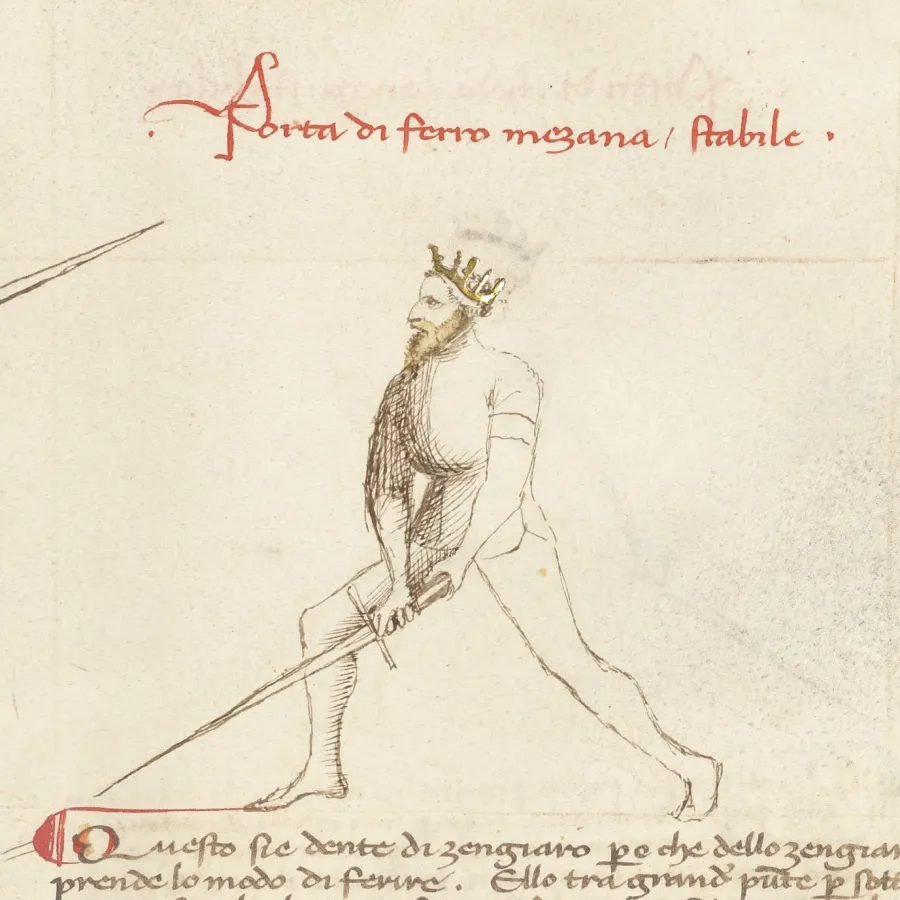

*Para algunas personas, esta postura en vez de ser pulsativa, se le considera estable. Esto debido a que para muchos, no es necesario utilizarla para realizar un golpe fulminante y al no enfocarse en prepararla con un paso previo para dicho propósito, puede cumplir un rol defensivo digno de guardia estable.*

**v-Posta di Falcone:** Esta guardia, la cual no es propia de Fiore sino de Vadi, se caracteriza por la mantención de la espada en alto y ligeramente en diagonal hacia atrás. Esta guardia alta permite realizar un fendente poderoso contra el rival, con la intención de realizar el determinado golpe fulminante en su contra.*

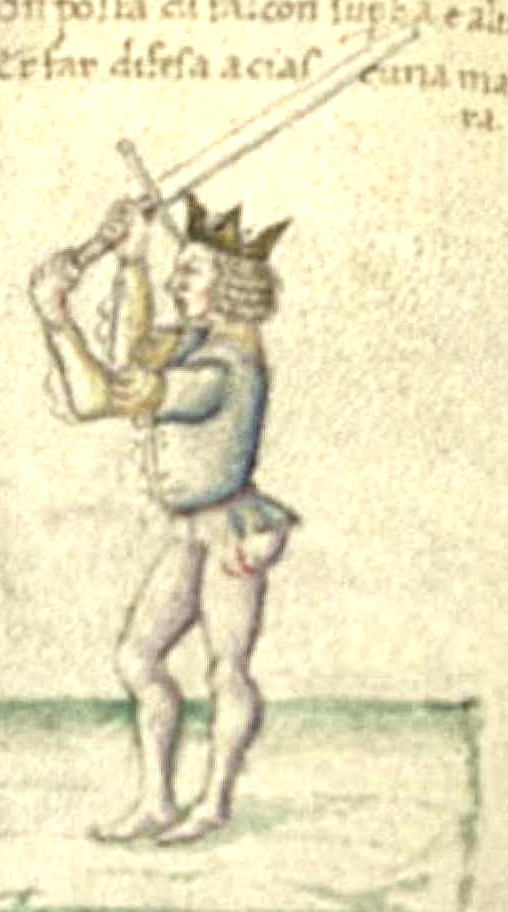

*Para muchos, esta guardia más que pulsativa, es inestable. Esto es debido a que no necesita ni preparar el golpe ni preocuparse de la lateralidad de los fendentes, cuando éstos se hacen verticales (por eso esta guardia es de Vadi y no de Fiore, ya que este último no creía en el uso de fendentes verticales).*

### Tabla resumen de las características de las postas:

|  |  |  |  |
|---|---|---|---|
| **Postas** | **Lateralidad** Necesidad de considerar el lado donde comienza el ataque de la guardia para su ejecución viable | **Preparación del golpe** (Antes de atacar con dicha guardia, se requiere un paso previo para su eficaz ejecución) | **Función con el rotare** |
| **Estables** | **No tienen** (Salvo Posta Di Fenestra) | **No tiene** | Mantienen la duración del rotare |
| **Inestables** | **Si tienen** | **No tiene** | Rompen o interrumpen el rotare |
| **Pulsativas** | **Si tienen** (Discutible en el caso de Posta di Falcone, si consideran si es inestable) | **Si tiene** | Comienzan o terminan el rotare |

## VII- Defensas o coberturas.

### VII-a: Concepto básico.

Cuando usamos la espada larga para acometer al adversario no solo lo hacemos para atacarlo, sino también para defendernos de sus embates.

Estas defensas o coberturas (como las denominaba Filipo Vadi),consisten en las maniobras que tienen como objeto la óptima detención del acometimiento del adversario contra nosotros.

Éstas por lo general, se rigen por dos principios básicos, los cuales son los siguientes:

i- Para defender el corte del rival, debo hacer el movimiento opuesto como su óptima defensa para repelerlo.

Ante esto, hay que imaginar que en frente de nuestro adversario, se configura una cruz imaginaria de la cual se exponen 4 cuadrantes (dos superiores y dos inferiores). Desde alguno  de ellos, emergerá el acometimiento del rival. Para defendernos de ellos, debemos hacer el movimiento en sentido opuesto del cuadrante opuesto.

Por ejemplo, en esta imagen se notará lo siguiente:

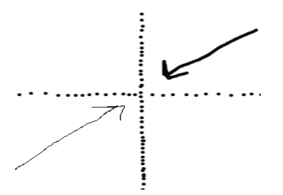

Si el ataque del rival (flecha oscura gruesa) comienza desde el cuadrante superior derecho, como si fuera un fendente diagonal, entonces nosotros debemos hacer como una adecuada defensa, un sottani diagonal desde el cuadrante inferior izquierdo (flecha negra fina).

ii- Las defensas pueden distinguirse entre sí según su intensidad de ejecución. En otras palabras, se pueden notar algunas más fuertes o recias y otras más pasivas o suaves a la hora de hacer contacto con el acometimiento del rival.

En consideración a estos dos principios, ahora hablaremos de las defensas o coberturas que tanto Fiore de Liberi como Filipo Vadi distinguen en sus manuales.

### VII-b: Coberturas según Fiore.

Fiore de Liberi distingue las siguientes dos defensas, partiendo desde las menos intensa a la más fuerte:

**i-Parata:** Esta acción defensiva consiste en interponer nuestra espada entre su ataque y nuestro propio cuerpo. Es decir cubrirse con la espada de un ataque oponente, de forma pasiva y firme.

**ii-Riposte:** Esta defensa implica atacar el ataque de mi adversario para hacerlo ineficiente, desviarlo o abrir una brecha. En otras palabras, es un movimiento defensivo tan intenso que en vez de solo parar de forma pasiva el ataque rival, busca anularlo yendo con intensidad en contra de éste.

### VII-c: Coberturas según Vadi.

Filipo Vadi reconoce como cobertas o coberturas, a las siguientes acciones defensivas en razón de su intensidad:

**i-Cruz (Lacrosse):** Esta maniobra busca obstaculizar el ataque del adversario con mi propia espada se posicionándose como una cruz frente al rival. Es decir, la espada adversaria quedará parada al interrumpirse su trayectoria con nuestra hoja en esa posición, ya que está tomada de forma firme y recia por nosotros.

**ii-Baratta:** Esta coberta tiene como objetivo el desviar el ataque del adversario, cambiando su trayectoria original, impidiendo que me golpee. Por tanto, es una defensa más activa la cual busca desviar en vez de parar secamente el acometimiento del oponente.

**iii-Rebater:** El rebater es una maniobra en la cual a través de un violento ataque hacia el acometimiento de mi adversario (el cual por lo general tiende a ser un fendente),se busca llevar la punta de la espada rival al piso, haciendo al ataque infectivo. Con ello, se deja al adversario en una desventajosa posición para un posterior contraataque nuestro.

## VIII-Juegos largos.

La parte final de la materia final de este año, versa sobre los juegos con la espada. A continuación,se analizará el concepto básico de lo que es un juego, según la noción aportada por Fiore de Liberi, como a su vez la aproximación de los juegos largos.

### VIII-a: Noción elemental de “juegos”:

Para efectos de este curso, se entenderá como un “juego” a “aquella estrategia utilizada acorde a la proximidad o lejanía que mantengo con el rival, para efectos de realizar con acometimiento concluyente”.

Por lo tanto, un juego es una estrategia, la cual entiende como “el proceso regulable que se tiene para obtener un resultado u objetivo de manera óptima”.

Por lo tanto, el juego en sí no se improvisa ni se realiza al azar, la idea es ejecutarla de manera predeterminada dentro del contexto previsto para obtener el objetivo que se pretende, el cual es el acometimiento concluyente sobre el rival.

### VIII-b: Juegos largos:

Cuando estamos en misura longa o distancia larga contra el rival, contamos con estrategias determinadas para acometer de forma favorable, los cuales son los juegos largos. Esto a continuación son los siguientes:

**i-Juego del Villano:** En esta maniobra, si el oponente nos ataca con un fendente, en respuesta a ello, procederemos a defendernos con una posta di fenestra. Al momento de que se junten o encuentren ambas espadas, usaremos la fuerza del impacto para impulsar nuestro propio contraataque de fendente. Todo ello, mientras hacemos el movimiento al unísono de pasar diagonalmente para reposicionarnos y obtener un ángulo idóneo para asestar dicho corte sobre la cabeza del adversario.

**ii-Dejar pasar:** Esta maniobra parte de la misma manera que el “juego del villano”, salvo que no se realiza el contacto de las espadas previo a nuestro contraataque con fendente y pasar a la vez. Simplemente se pasa cambiando de ángulo, evadiendo el fendente del oponente para inmediatamente contratacarlo con nuestro propio fendente sobre la cabeza de mi adversario.

**iii-Bajar la punta:** En esta maniobra, tanto nosotros como el rival entramos chocamos las espadas al mismo tiempo,quedando por ello en incrosada o mezamella. Desde ese momento, la maniobra diferirá en dos opciones:

a-Si la incrosada se ha dado en nuestra parte más baja o fuerte de la hoja (el punto de contacto de nuestras hojas está más bajo), bajaremos nuestra punta de la espada, mientras nos reposicionamos a la vez, para tener un mejor ángulo de entrada y golpear la cabeza del adversario.

b-Si por el contrario el punto de contacto de nuestras hojas ha quedado en una posición más alta, también nos reposicionaremos para tener un mejor ángulo de entrada, pero en vez de bajar la punta siguiendo la trayectoria del golpe original, cambiaremos el ángulo y posición de nuestra espada, quedando en fenestra, y usando la punta de nuestra arma para herirlo en el pecho, estocándolo (incluso podemos usar los gavilanes de nuestra arma para adquirir mejor dominio sobre la hoja del oponente, antes de estocarlo).

**iv-Cambiar la punta:** Al igual que en el juego anterior, al avanzar y atacar se dará una situación de incrosada o mezzamela, sin embargo en esta oportunidad y sin que las espadas pierdan contacto entre si se cambiara de filo verdadero a filo falso.

Posteriormente y siempre siguiendo el contacto de nuestra hoja con la del contrincante, nuestra espada recorrerá la hoja del adversario hacia su débil para que al llegar a la punta de la misma se libere de su contacto, intentando golpear al rival con un sotani con filo falso. Todo ello, mientras que a la vez nos reposicionamos con pasar, para así golpear más cómodamente al rival.

**v-Finta:** En este juego, tanto nosotros como el adversario atacaremos como en las técnicas anteriores, buscando una incrosada o mezzamela. Pero en esta ocasión, antes de que nuestras espadas lleguen a tener contacto entre sí, cambiaremos la trayectoria y ángulo de nuestra hoja, con el objetivo de evitar que nuestras armas lleguen a entrar en contacto. Acto seguido, reposicionaremos nuestra arma con el fin de que quedemos en posición óptima para hacer una estocada al pecho del adversario.

**Hasta acá toda la materia del año 2023 ¡Por favor estudien, sino el fantasma de ~~Iván~~ se los va a rajar!**
